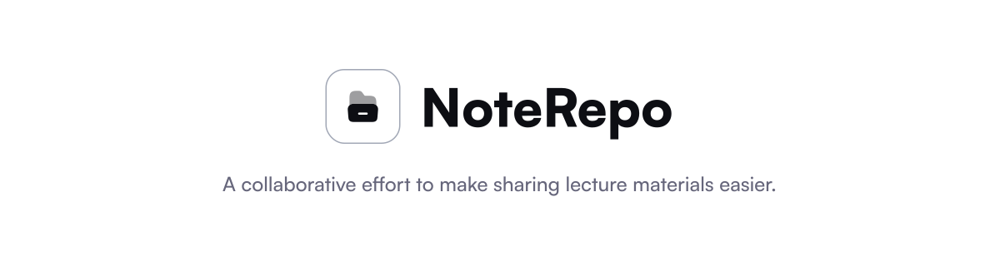

# Web Client


Web client for the NoteRepo backend written with NextJS and Typescript.  
[NoteRepo](https://noterepo-web.vercel.app/) is a collaborative effort to make access to our university course materials easier by uploading them in a central hub.

## Developer Notes

We're actively looking for contributors as we're only two engineers working on it at the moment. So if you know NextJS and optionally Typescript, feel free to submit pull requests, they're always welcome!

## Building the client in development mode

To get started, git clone the repository and cd into it.

```sh
git clone https://github.com/NoteRepoLabs/note-repo-web-client.git
cd note-repo-client
```

Then install the dependencies using `npm`

```sh
npm install
```

You can run the client in development mode using this command (Linux).

```sh
chmod +x ./clean.sh ./build.sh ./dev.sh
./dev.sh
```

On Windows systems, you can use `npm run dev`.

## Encryption Key

NoteRepo encrypts data it saves on your device to improve security and as such you might encounter errors while trying to build from source. To fix this, generate and store your encryption key in a `.env` file.

```sh
openssl rand -base64 32
```

You can paste the key in the `.env.example` file and rename that to `.env`.

## Bug Reports

The client is still in its early stages, so bugs may be present. You can report any bugs you find using the `issues` tab if it's not already present and being fixed.
